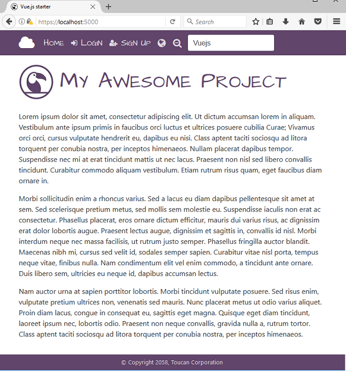

# Toucan

This is an opinionated multi-project solution template, combining .NET Core and VueJs.

The main objective is to provide scaffolding for an SPA web application, that incorporates SOLID design principles.

## Features
* localization
* validation
* global application state/event bus
* multiple optimized entry points
* token-based authentication
* support for local or external authentication providers
* HMR support for development

## Preview


## Getting Started

These instructions will get a copy of the project up and running on your local machine for development purposes.

### Prerequisites

* [.NET Core SDK 1.0.1](https://www.microsoft.com/net/core/#windowscmd)
* [Visual Studio Code](https://code.visualstudio.com/download/) (or a similar text-based editor like Sublime)
* [TypeScript](https://www.typescriptlang.org/)
* [Node.js](https://nodejs.org/en/)
* [PostgreSQL](https://www.postgresql.org/) or [SQL Server](https://www.microsoft.com/en-us/sql-server/sql-server-downloads)

### Installing

via Yeoman

```DOS
npm install generator-toucan
yo toucan
```

or using [setup](SETUP.md) instructions 

## Architecture

Be sure to check out [README](src/server/README.md) for details on MVC middleware and filters being used in the pipeline.

### .NET Core
See the readme files for each project
* [contract](src/contract/README.md)
* [common](src/common/README.md)
* [data](src/data/README.md)
* [service](src/service/README.md)
* [server](src/server/README.md)

### VueJs & Webpack
See the readme file below
* [ui](src/ui/README.md)

## Overview

### Authentication
[JWT Bearer](https://tools.ietf.org/html/rfc7523) tokens are issued by the server. These tokens contain profile data and claims relating to a user. Authentication can be done in two different ways.

#### via Local Provider
This requires a user to create an account using the signup form. In this scenario, the server

* enforces a minimum password complexity rule when signing up
* generates a salt, and stores hashed password to the database
* retreives and maps user profile data and permissions when generating client tokens

#### via External Providers
This is performed using a variation on the [implicit workflow](https://tools.ietf.org/html/rfc6749#section-1.3.2). The sequence of events is as follows. 

* browser obtains a one-use nonce from local server (which must be redeemed/used before it expires)
* the browser is redirected to external provider, and authenticated
* external provider issues a redirect, and returns the nonce and access token details via uri (ie. _http://localhost:5142/#state=XYZ&access_token=4/P7q7W91&token_type=Bearer&expires_in=3600_)
* the vuejs application is bootstrapped, and checks the uri hash for nonce and access_token
* if present, these are passed to the local server
* the local server validates the nonce and access token, and if satisfied, issues the client with a local token (the external access token is also revoked)

If this is the first time a user has logged in using this external provider, a user account will be created for them based on data from external profile data APIs.

### Verification

Before a site user can access restricted content they need to verify their account details using some form of two-factor authentication. They are redirected to the verification page when appropriate.

The default implementation is as follows

* user asks site to issue a verification code
* server returns verification code
* client browser outputs the verification code using `console.info()` and displays form on page
* the verification code is submitted, and a new access token (with updated details) is issued by the server

### Authorization
Server-side routes are protected via [policies](https://docs.microsoft.com/en-us/aspnet/core/security/authorization/policies) which provide more flexibility than traditional role-based models.

Client-side routes are protected via [navigation guards](http://router.vuejs.org/en/advanced/navigation-guards.html), which check user claims contained in access tokens issued by the server.

> If an authorization check on the web server fails, a challenge is issued to the client browser. Normally this results in a 302 redirect, but this behaviour has been modified using custom middleware in *./src/server/Startup.Auth.cs*. This middleware instead returns a 401 Unauthorized response whilst setting Response header _Location=XXX_. The client-side Axios library then handles this appropriately, by way of a global http response interceptor.

### Security

TLS is provided by using a self-signed X509 certificate (see _./src/server/resources_ )

Support for [CSRF](https://en.wikipedia.org/wiki/Cross-site_request_forgery) has been provided.

> The site sets CSRF session cookies whenever an access token is issued

The Axios library automatically uses this cookie to append the anti-forgery token to outbound POST, PUT and DELETE requests.

## Tests

For .NET Core, a sample XUnit test is provided as a starting point */test/* directory

## Built With

* [.NET Core](https://www.microsoft.com/net/core) - .NET Core is a general purpose development platform maintained by Microsoft and the .NET community on GitHub.
* [Axios](https://github.com/mzabriskie/axios) - Promise based HTTP client for the browser and node.js
* [Bootstrap](http://getbootstrap.com/) - Bootstrap is the most popular HTML, CSS, and JS framework for developing responsive, mobile first projects on the web.
* [StructureMap](http://structuremap.github.io/) - IOC/DI container
* [TypeScript](https://www.TypeScriptlang.org/) - TypeScript is a typed superset of 
Javascript that compiles to plain JavaScript
* [Vue.js](https://vuejs.org/v2/guide/) - Simple yet powerful library for building modern web interfaces
* [xUnit.net](https://xunit.github.io/) - xUnit.net is a free, open source, community-focused unit testing tool for the .NET Framework.

## Contributing

It is what it is.

## Authors

* [mrellipse](https://github.com/mrellipse)

## License

This project is licensed under the MIT License - see the [LICENSE](LICENSE) file for details

## Acknowledgments

* Wille Ristimäki for [vue.js-starter-template](https://github.com/villeristi/vue.js-starter-template)
* Nate Barbettini for [SimpleTokenProvider](https://github.com/nbarbettini/SimpleTokenProvider)
* Monterail for [Vuelidate](https://monterail.github.io/vuelidate/)

*[EF]: Entity Framework
