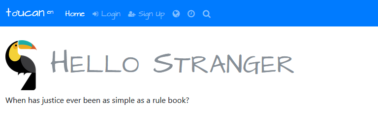

# toucan!

> is an opinionated multi-project solution template, combining .NET Core and Vue.js.
> The objective is to provide scaffolding for a responsive SPA web application, based on SOLID design principles.



## Features

* loading screen
* multiple entry points
* token-based authentication for local & external providers
* two factor verification based on device profile
* role & claims management (NEW)
* comprehensive [localization](src/I18N.md) support (server and client)
* global application state/event bus
* hot module reloading for development
* data migrations

For more details about the implementations of features, you can refer to [security](SECURITY.md), [localization](src/I18N.md), [server](src/server/README.md) or [ui](src/ui/README.md) documents

## Setup

Your development machine will need to have the following installed.

* [.NET Core SDK 2.1](https://www.microsoft.com/net/core/#windowscmd)
* [Webpack 4+](https://webpack.js.org/api/cli/)
* [Node.js](https://nodejs.org/en/)
* [PostgreSQL](https://www.postgresql.org/) or [SQL Server](https://www.microsoft.com/en-us/sql-server/sql-server-downloads)
* [Visual Studio Code](https://code.visualstudio.com/download/) (or a similar text-based editor like Sublime)

### Installing

via Yeoman

```DOS
npm install --global generator-toucan
yo toucan
```

or using [setup](SETUP.md) instructions 

## Release History

All ui and server packages are up to date as 16 July 2018. See [releases](https://github.com/mrellipse/toucan/releases) for a history of recent changes

## Built With

* [.NET Core](https://www.microsoft.com/net/core) - .NET Core is a general purpose development platform maintained by Microsoft and the .NET community on GitHub.
* [TypeScript](https://www.TypeScriptlang.org/) - TypeScript is a typed superset of Javascript that compiles to plain JavaScript
* [Vue.js](https://vuejs.org/v2/guide/) - Simple yet powerful library for building modern web interfaces
* [Bootstrap](http://getbootstrap.com/) - Bootstrap is the most popular HTML, CSS, and JS framework for developing responsive, mobile first projects on the web.
* [Axios](https://github.com/mzabriskie/axios) - Promise based HTTP client for the browser and node.js
* [StructureMap](http://structuremap.github.io/) - IOC/DI container

## Authors

* [mrellipse](https://github.com/mrellipse)

## License

This project is licensed under the MIT License - see the [LICENSE](LICENSE) file for details

## Acknowledgments

* Wille Ristimäki for [vue.js-starter-template](https://github.com/villeristi/vue.js-starter-template)
* Nate Barbettini for [SimpleTokenProvider](https://github.com/nbarbettini/SimpleTokenProvider)
* Monterail for [Vuelidate](https://monterail.github.io/vuelidate/)
* Simon de la Salle [Toucan](http://simondelasalle.com/blog/)

*[EF]: Entity Framework